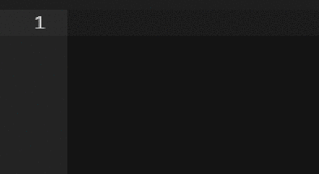
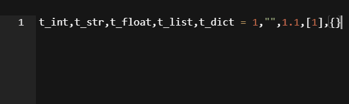
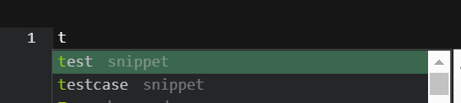

Electron Text Editor
==
# Name
python用のエディター
以下英語で書いてますが、editor内の表示は現状すべて日本語です。

***a3c3(auto 3 commands 3)***
* Auto 3
    * auto import 
        > 
    * auto typing
        > 
    * auto learning
        1. 

* Commands 3
    * easy shortcut commands
    * remote sending commands
    * palette Commands 
    
#  extentions
    #before Build
    #pwd
    #hogehoge/a3c3
    #if you want to all extentions
        * git clone https://github.com/welm332/extends.git
    #you want you extention name
        * yarn run extensions intall [extention name]
    
# Build
    yarn install
# Usage
    yarn  install
    #if no build:
        yarn run start
    #else:
        a3c3
